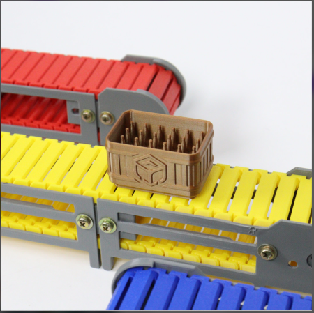
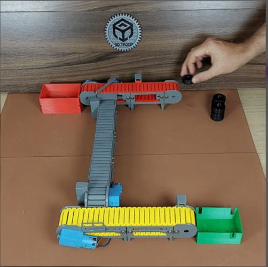
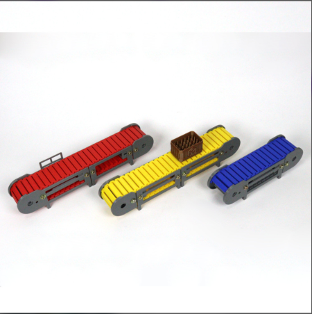

# Projet-cim-a26
Projet: Convoyeur Modulaire Industriel automne 2026





# Objectif du projet
Ce projet est un système qui permet de trier des objets en fonction de leur poids avec l'aide de convoyeur.

# Structure générale du dépôt

```text
[nom-du-projet-a26]
│
├── README.md
│   └── Présentation globale du projet
│
├── images/
│   ├── image-1.png
│   ├── image-2.png
│   └── ...
│
├── projet-original/
│   ├── documentations/
│   │   ├── fichier-explications.md
│   │   ├── fichier-montage.md
│   │   ├── BOM.xls
│   │   └── fichiers-electroniques.md
│   │
│   ├── stl-originaux/
│   │   ├── explications.md
│   │   │
│   │   ├── Accessoires/
│   │   │   ├── coin.stl
│   │   │   └── door.stl
│   │   │
│   │   └── Coils/
│   │       ├── coil5.stl
│   │       └── coil6.stl
│
└── scrum/
    ├── carnet-de-produit/
    │   ├── objectif-de-produit.md
    │   └── carnet-de-produit.md
    │       └── À jour
    │
    ├── sprint-1/
    │   ├── objectif-de-sprint.md
    │   ├── carnet-de-sprint.md
    │   ├── revue-de-sprint.md
    │   └── retro-de-sprint.md
    │
    ├── sprint-2/
    │   └── Gabarits à remplir au Sprint 2
    │
    └── sprint-3/
        └── Gabarits à remplir au Sprint 3
```

## Description des répertoires

### `README.md`

Contient la présentation générale du projet, son objectif, son fonctionnement ainsi que les informations importantes permettant de comprendre le dépôt.

### `images/`

Répertoire contenant les images utilisées dans la documentation du projet.

Les images doivent être au format **PNG**.

Exemple :

```text
images/
├── image-1.png
├── image-2.png
└── ...
```

### `projet-original/`

Contient tout le nécessaire pour **reconstruire le prototype initial**, incluant la documentation, les fichiers électroniques et les modèles 3D originaux.

#### `documentations/`

Contient les documents nécessaires à la compréhension et au montage du prototype :

- `fichier-explications.md` — Explications du prototype.
- `fichier-montage.md` — Instructions de montage.
- `BOM.xls` — Liste des composants (*Bill of Materials*).
- `fichiers-electroniques.md` — Documentation des composants électroniques.

#### `stl-originaux/`

Contient les modèles 3D originaux utilisés pour le prototype.

- `explications.md` — Explications concernant les modèles 3D.
- `Accessoires/` — Modèles des accessoires.
- `Coils/` — Modèles des bobines.

### `scrum/`

Contient toute la documentation liée à la **gestion Agile / SCRUM** du projet.

#### `carnet-de-produit/`

Contient les documents liés au produit :

- `objectif-de-produit.md` — Objectifs généraux du produit.
- `carnet-de-produit.md` — Carnet de produit maintenu à jour.

#### `sprint-1/`

Contient la planification et le bilan du **Sprint 1** :

- `objectif-de-sprint.md` — Objectif du Sprint.
- `carnet-de-sprint.md` — Travail planifié et réalisé.
- `revue-de-sprint.md` — Revue du Sprint.
- `retro-de-sprint.md` — Rétrospective du Sprint.

#### `sprint-2/`

Contient les gabarits qui seront complétés lors du **Sprint 2**.

#### `sprint-3/`

Contient les gabarits qui seront complétés lors du **Sprint 3**.

##  Démarrage rapide

### 1. Prérequis
- Carte Nucleo‑L432KC  
- STM32CubeIDE installé  
- Câble USB pour programmer la carte  
- (Optionnel) Bibliothèque SSD1306 pour l’écran OLED  
- (Optionnel) Librairie pour le capteur de poids / HX711

---

### 2. Cloner le projet
```bash
git clone https://github.com/Drac777-spec/projet-cim-a26.git
cd projet-cim-a26
